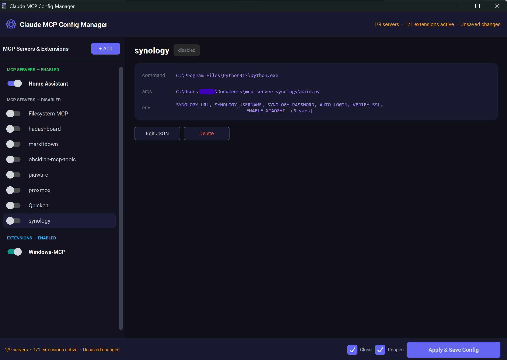
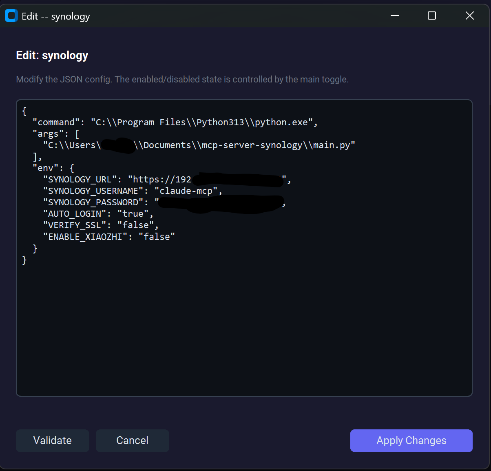

# Claude MCP Config Manager

A Windows desktop app for managing MCP servers and Claude Desktop Extensions in one place. Toggle servers on and off, add new ones, edit configurations, and apply changes — without hand-editing JSON files. I created this so that only the MCP servers required for a specific task are loaded, reducing the load on context and token burn by having unnecessary MCP servers loaded. YMMV.


## What It Does

Claude Desktop uses `claude_desktop_config.json` to know which MCP servers to load. Editing that file by hand is tedious and error-prone. This app gives you a visual toggle interface and maintains its own library (`mcp_library.json`) as the source of truth.

- **MCP Servers**: Add, remove, enable/disable, and edit server configurations. On Apply, only enabled servers are written to Claude Desktop's config.
- **Extensions**: Automatically discovers installed Claude Desktop Extensions and lets you enable or disable them.
- **Restart Integration**: Optionally closes and reopens Claude Desktop after applying, so changes take effect immediately.

## Installation

### Option A: Download the exe (recommended)

1. Download `Claude MCP Config Manager.exe` from the [Releases](https://github.com/michael-t-lambert/Claude-MCP-Config-Manager/releases) page.
2. Place it in a folder of your choice (e.g., `C:\Tools\Claude MCP Config Manager\`).
3. Double-click to run. No installation required.

The app creates `mcp_library.json` and `manager_prefs.json` in the same folder as the exe on first run.

### Option B: Run from source

Requires Python 3.11+ and `customtkinter`:

```powershell
pip install customtkinter
python mcp_manager.py
```

## First Launch: Importing Your Existing Config

If you already have MCP servers configured in Claude Desktop, the app will automatically import them on first launch. It checks these locations in order:

| Location | Description |
|----------|-------------|
| `~/Downloads/claude_desktop_config.bak.json` | Backup copy in Downloads |
| `~/Downloads/claude_desktop_config.json` | Config copy in Downloads |
| `%APPDATA%/Claude/claude_desktop_config.json` | Live Claude Desktop config |

The first file found with `mcpServers` entries is imported. All imported servers are added to the app's library with their existing enabled/disabled state preserved.

After the initial import, the app also continuously discovers any new servers that appear in Claude Desktop's live config (e.g., servers added by other tools) and merges them into the library.

**You do not need to reconfigure anything.** Just launch the app and your existing servers will appear.

## Usage

1. **Launch** the app.
2. **Toggle** servers or extensions on/off in the left panel.
3. **Click a server** to view its full configuration in the right panel.
4. **+ Add** to create a new MCP server entry.
5. **Edit JSON** to modify a server's raw configuration (command, args, env).
6. **Delete** to remove a server from the library.
7. **Apply & Save Config** to write changes to Claude Desktop.

The **Close** and **Reopen** checkboxes at the bottom control whether the app automatically restarts Claude Desktop after applying. Claude Desktop must be restarted for MCP changes to take effect.

## Backups and Safety

**Your configuration is never lost.** Every time you click Apply, the app creates a timestamped backup of Claude Desktop's config before writing any changes.

### Where backups live

Backups are saved in the same folder as Claude Desktop's config:

```
%APPDATA%\Claude\
```

They follow this naming pattern:

```
claude_desktop_config.20250528-143022.bak.json
                      ^^^^^^^^ ^^^^^^
                      date     time (HHMMSS)
```

A new backup is created on every Apply, so you always have a history of previous states.

### Additional safety measures

- **Atomic writes**: Config files are written to a temp file first, then moved into place. A crash mid-write won't corrupt your config.
- **Non-destructive merges**: The app only replaces the `mcpServers` section. All other top-level keys in `claude_desktop_config.json` (like `globalShortcut`, `allowedDirectories`, etc.) are preserved.
- **Unsaved changes warning**: If you close the app with unapplied changes, it will prompt you before exiting.
- **Separate library file**: The app's own `mcp_library.json` is independent of Claude Desktop's config. Even if Claude Desktop's config is reset or corrupted, your server library remains intact.

### Restoring a backup

If something goes wrong, copy any backup file over the live config:

```powershell
cd "$env:APPDATA\Claude"
# List available backups (newest first)
Get-ChildItem claude_desktop_config.*.bak.json | Sort-Object LastWriteTime -Descending
# Restore one
Copy-Item claude_desktop_config.20250528-143022.bak.json claude_desktop_config.json
```

Then restart Claude Desktop.

## Files

| File | Purpose |
|------|---------|
| `mcp_manager.py` | Application source |
| `mcp_library.json` | Your server and extension library (created on first run) |
| `manager_prefs.json` | UI preferences: window position, close/reopen toggles |
| `Claude MCP Config Manager.spec` | PyInstaller build configuration |
| `assets/config-toggles.ico` | Application icon |

## Building from Source

```powershell
pip install customtkinter pyinstaller
pyinstaller --clean --noconfirm "Claude MCP Config Manager.spec"
```

The exe is created at `dist\Claude MCP Config Manager.exe`.

## Requirements

- **Windows 10/11**
- **Claude Desktop** (Windows Store or standalone install)
- No admin privileges required

## How It Works (Technical)

The app maintains two separate data stores:

1. **`mcp_library.json`** (next to the exe) — the full library of all servers and extensions you've configured, including disabled ones. Claude Desktop never reads this file.

2. **`claude_desktop_config.json`** (`%APPDATA%\Claude\`) — Claude Desktop's actual config. On Apply, the app writes only enabled servers here.

This separation means you can keep a large collection of MCP servers and quickly toggle them without losing their configurations. Disabled servers exist only in the library, not in Claude Desktop's config.

Extensions are managed through `Claude Extensions Settings/<extension-id>.json` files, which Claude Desktop reads on startup to determine which extensions are active.
